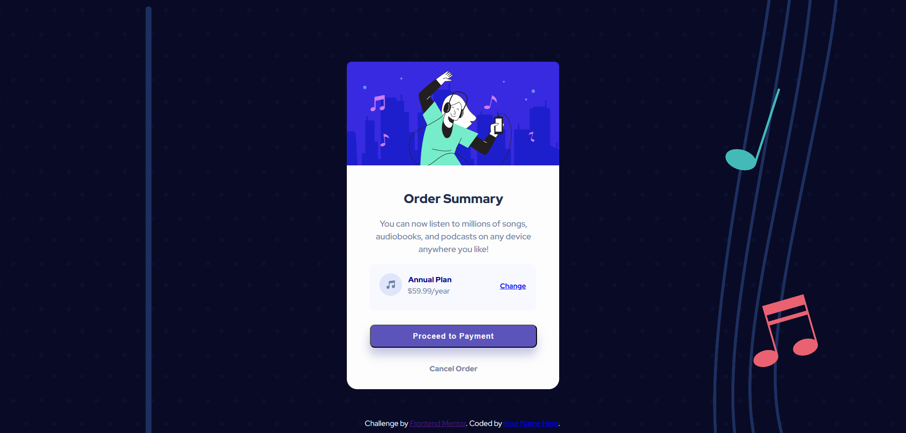

# Frontend Mentor - Order summary card solution

## Table of contents

- [Overview](#overview)
  - [The challenge](#the-challenge)
  - [Screenshot](#screenshot)
  - [Links](#links)
- [My process](#my-process)
  - [Built with](#built-with)
  - [Other tools used](#other-tools-used)
  - [What I learned](#what-i-learned)
  - [Useful resources](#useful-resources)


## Overview

### The challenge

Users should be able to:

- See hover states for interactive elements

### Screenshot

![]
![]


### Links

- Solution URL: [https://github.com/andr-ch/Order-summary-card.git]
- Live Site URL: [https://andr-ch.github.io/Order-summary-card/]

## My process

### Built with

- Semantic HTML5 markup
- CSS custom properties
- Flexbox
- CSS Grid
- Mobile-first workflow


### Other tools used:
- Pesticide extension -> this is perfect to outline eacth element to better see the placement on the page  
- Developer tools -> available on any browser and is ideal for experimenting with changes to your page without affecting your code
- Imagecolorpicker -> used to choose a color and obtain the corresponding HTML Color Code for the selected pixel of an uploaded picture
- Convertingcolors -> perfect for converting colors and getting all the details about the converted color


### What I learned


1.Using tags for attribution when using Freepik images:
```html
<figcaption>
  <a href="https://www.freepik.com/free-vector/trumpet-notes-neon_38266911.htm#fromView=search&page=1&position=22&uuid=4d2d382c-59c6-4d1c-a241-fae119f48b14">Image by jemastock</a> on Freepik
</figcaption>
```

2. Utilizing letter spacing to create a more expansive effect for paragraphs:
```css
button {
letter-spacing: 1px;
}
```

3. Using floating to adjust the position of an image while introducing space between it and surrounding text:
```css
.icon-1 {
    float: left;
    margin-right: 7px;
}
```

4. Arranging two texts to stack vertically with added spacing between them:
```css
.txt-1, .txt-2 {
    line-height: 0.5em;
    margin-right: 10px;
    position: relative;
    right: 82px;
    top: 3px;
}
```

5. Utilizing the display property to conceal elements based on desktop and mobile views:
- for desktop view:
```css
figcaption {
display: none;
}
```
- for mobile view:
```css
@media only screen and (max-width: 768px) {
    .attribution, figcaption {
      display: none; /* Hides the footer & cite */
    }
}
```


### Useful resources

- [imagecolorpicker](https://imagecolorpicker.com/) - This is perfect if you want to extract colors from images.

- [convertingcolors](https://convertingcolors.com/) -  Useful for converting between various color formats such as HSL, RGB, and more. Additionally, it offers a range of other color-related tools and apps to assist in various tasks.

- [cssmatic](https://www.cssmatic.com/border-radius) - Helpful for experimenting and generating CSS styles such as border radius, box shadow, and more.

- [color-hex](https://www.color-hex.com) - good resource for exploring and discovering color codes, such as hexadecimal color codes commonly used in web design and digital graphics.

